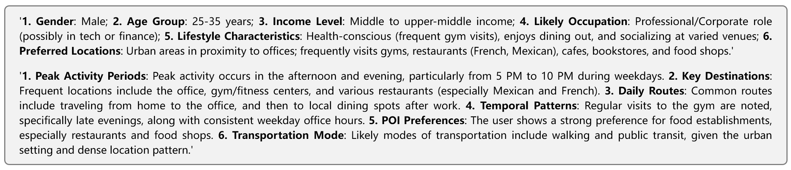
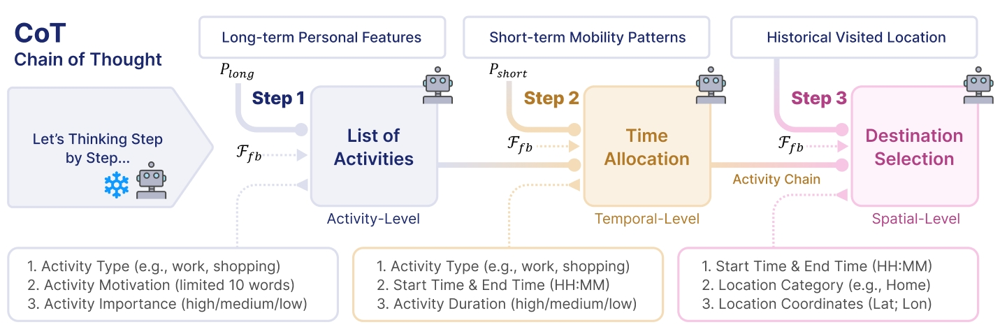

# DaiLLM for Simulating Human Mobility

DaiLLM: A Large Language Model Based Agent Framework with AI Feedback Reinforcement for Simulating Human Mobility. This project implements a GAN-like architecture using Large Language Models (LLMs) to generate human mobility trajectories.

## Usage
1. Install dependencies:
```bash
pip install -r requirements.txt
```

2. Run the main script:
```bash
python main.py
```

## Components

### Profiler
- Analyzes long-term user profiles $P_{long}$
- Identifies short-term mobility patterns $P_{short}$



### Generator
- Chain of Thought (CoT) based approach
- 3 rounds Q&A process based on $P_{long}$ and $P_{short}$
- Maintains temporal and spatial consistency
- Generates realistic activity sequences $T_{real}$
- $T_{gen}^{(k+1)}=G_{LLM} (P_{long},P_{short},T_{real},F_{fb}^{(k)})$

### Discriminator
- Evaluates generated trajectories based on Reinforcement Learning from AI Feedback (RLAIF) mechanism
- Validates generated results
- $s^{(k+1)},F_{fb}^{(k+1)}=D_{LLM} (T_{gen}^{(k+1)},T_{real})$




## 📌Paper Will Comming Soon🤗